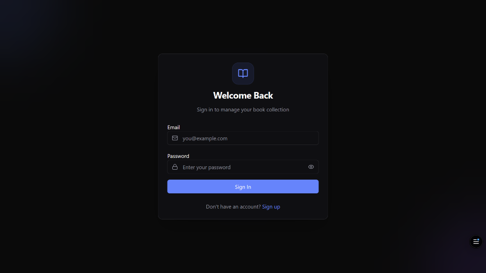
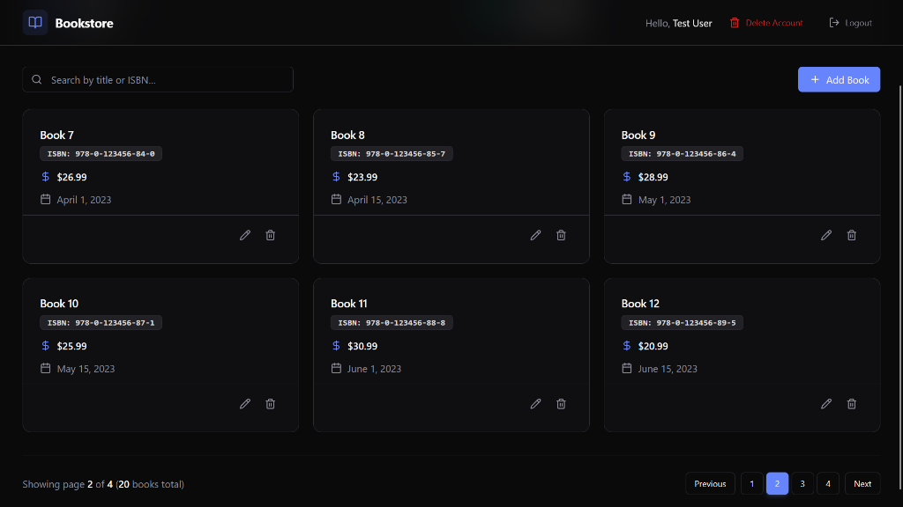

<div align="center">

# 📚 Bookstore — Full-Stack Book Collection Manager

### Built during my Full Stack Developer Internship at [DevelopersHub Corporation](https://www.linkedin.com/company/developershub-corporation/)

[](https://bookstore-by-sheraz.vercel.app)
[](#-tech-stack)
[](#-internship-context)

A modern, full-stack web application for authors to manage their book collections. Built with a robust **Express.js v5** backend using **PostgreSQL** and a sleek **React 19** frontend featuring a premium dark-mode design with glassmorphism effects.

[Live Demo](https://bookstore-by-sheraz.vercel.app) · [Features](#-features) · [Tech Stack](#-tech-stack) · [API Docs](#-api-documentation) · [Getting Started](#-getting-started)

</div>

---

## 🖼️ Screenshots

### Login Screen


### Dashboard (with Pagination & Stats)


---

## 🏢 Internship Context

This project was designed and developed during my **Full Stack Developer internship** at **[DevelopersHub Corporation](https://www.linkedin.com/company/developershub-corporation/)** (May 2026 – June 2026). It served as a key internship deliverable demonstrating modern full-stack development with TypeScript across the entire stack.

**Internship objectives covered:**
- Build a production-ready full-stack TypeScript application from scratch
- Design and implement a RESTful API with Express.js v5 and PostgreSQL
- Implement secure JWT-based authentication with role-based access control
- Use database migrations for version-controlled schema management
- Build a modern React 19 frontend with Redux Toolkit for state management
- Write API tests for backend validation
- Deploy frontend on Vercel and backend on Render with Neon PostgreSQL

---

## ✨ Features

| Feature | Description |
|---------|-------------|
| **Author Authentication** | Secure registration and login with JWT-based auth |
| **Book Management** | Full CRUD operations — create, read, update, and delete books |
| **Dashboard Analytics** | At-a-glance stats showing total books and collection value |
| **Search & Filter** | Instantly search books by title or ISBN |
| **Pagination** | Server-side pagination for large book collections |
| **Responsive Design** | Seamless experience across mobile, tablet, and desktop |
| **Dark Mode** | Premium dark theme with glassmorphism effects and smooth animations |
| **API Testing** | Built-in test suite for backend API validation |

---

## 🛠️ Tech Stack

### Backend
| Technology | Purpose |
|---|---|
| **Node.js** | Runtime environment |
| **Express.js v5** | Web framework (latest version) |
| **TypeScript** | Full type safety across backend |
| **PostgreSQL** (Neon) | Relational database |
| **pg-promise** | PostgreSQL client library |
| **JWT (jsonwebtoken)** | Authentication tokens |
| **bcrypt** | Password hashing |
| **Database Migrations** | Version-controlled schema changes |

### Frontend
| Technology | Purpose |
|---|---|
| **React 19** | UI framework (latest version) |
| **TypeScript** | Full type safety across frontend |
| **Vite 8** | Build tool & dev server |
| **Redux Toolkit** | Global state management |
| **React Router v7** | Client-side routing |
| **Tailwind CSS v4** | Utility-first styling |
| **shadcn/ui** | Component library |
| **Radix UI** | Accessible UI primitives |
| **Axios** | HTTP client |
| **Lucide React** | Icon library |
| **Inter (Google Fonts)** | Typography |

### Deployment
| Service | Purpose |
|---|---|
| **Vercel** | Frontend hosting |
| **Render** | Backend API hosting |
| **Neon** | Serverless PostgreSQL database |

---

## 🏗️ Architecture

```
┌─────────────────────────────────────────────────────┐
│            FRONTEND (Vercel)                       │
│    React 19 + TypeScript + Tailwind CSS v4         │
│    + Redux Toolkit + shadcn/ui + Radix UI          │
│                                                    │
│  ┌──────────┐  ┌──────────┐  ┌───────────────┐  │
│  │Dashboard │  │  Book    │  │  Auth (Login  │  │
│  │ + Stats  │  │  CRUD    │  │  & Register)  │  │
│  └────┬─────┘  └────┬─────┘  └──────┬────────┘  │
│       │              │               │           │
├───────┼──────────────┼───────────────┼───────────┤
│                   REST API                        │
├─────────────────────────────────────────────────────┤
│            BACKEND (Render)                       │
│     Express.js v5 + TypeScript                    │
│                                                   │
│  ┌──────────┐  ┌──────────┐  ┌───────────────┐  │
│  │  Author  │  │  Book    │  │   JWT Auth    │  │
│  │Controller│  │Controller│  │  Middleware   │  │
│  └────┬─────┘  └────┬─────┘  └──────┬────────┘  │
│       └──────────────┼───────────────┘           │
│            ┌───────┴────────────┐               │
│            │  PostgreSQL (Neon) │               │
│            │  + Migrations      │               │
│            └────────────────────┘               │
└─────────────────────────────────────────────────────┘
```

---

## 📁 Project Structure

```
bookstore/
├── backend/
│   ├── config/              # Database & env configuration
│   ├── controllers/         # Route handlers
│   │   ├── authorController.ts
│   │   └── bookController.ts
│   ├── middlewares/          # JWT auth middleware
│   ├── migrations/           # Database migration scripts
│   ├── routes/               # API route definitions
│   ├── utils/                # JWT utility functions
│   ├── tests/                # API test suite
│   ├── server.ts             # Express app entry point
│   └── package.json
│
├── frontend/
│   ├── src/
│   │   ├── components/       # Reusable UI components
│   │   │   └── ui/           # shadcn/ui primitives
│   │   ├── pages/            # Route page components
│   │   ├── services/         # API service layer (Axios)
│   │   ├── store/            # Redux slices & store config
│   │   ├── types/            # TypeScript type definitions
│   │   ├── lib/              # Utility functions
│   │   ├── App.tsx           # Root component with routing
│   │   └── main.tsx          # Entry point
│   └── index.html
│
├── images/                  # Screenshots for documentation
└── README.md
```

---

## 📡 API Documentation

### Authentication
| Method | Endpoint | Description |
|---|---|---|
| `POST` | `/api/authors/register` | Register a new author |
| `POST` | `/api/authors/login` | Login and receive JWT token |
| `DELETE` | `/api/authors/delete` | Delete author account (protected) |

### Books (All Protected — Requires JWT)
| Method | Endpoint | Description |
|---|---|---|
| `POST` | `/api/books/create-book` | Create a new book |
| `GET` | `/api/books/get-books` | Get all books for authenticated author |
| `GET` | `/api/books/get-book/:isbn` | Get a specific book by ISBN |
| `PUT` | `/api/books/update-book/:isbn` | Update a book |
| `DELETE` | `/api/books/delete-book/:isbn` | Delete a book |

### Request/Response Examples

**Register:**
```json
// POST /api/authors/register
{
  "name": "John Doe",
  "email": "john@example.com",
  "password": "securepassword"
}

// Response 201
{
  "message": "Author registered successfully",
  "author": { "name": "John Doe", "email": "john@example.com" },
  "token": "eyJhbGciOiJIUzI1NiIs..."
}
```

**Create Book:**
```json
// POST /api/books/create-book
// Headers: Authorization: Bearer <token>
{
  "isbn": "978-3-16-148410-0",
  "title": "The Great Book",
  "price": 29.99,
  "published_date": "2024-01-15"
}
```

---

## 🧪 Testing

```bash
cd backend
npm test
```

---

## 🚀 Getting Started

### Prerequisites
- **Node.js** v18+
- **PostgreSQL** database (or a [Neon](https://neon.tech) account)
- **npm** package manager

### Backend Setup
```bash
cd backend
npm install
```

Create a `.env` file:
```env
DATABASE_URL=your_postgresql_connection_string
PORT=3000
JWT_SECRET=your_secret_key
ORIGINS=http://localhost:5173
```

Run database migrations:
```bash
npm run migrate:up
```

Start the development server:
```bash
npm run dev
```

### Frontend Setup
```bash
cd frontend
npm install
```

Create a `.env` file:
```env
VITE_BACKEND_URL=http://localhost:3000
```

Start the app:
```bash
npm run dev
```

The app will be available at `http://localhost:5173`.

---

## 🔑 Environment Variables

### Backend
| Variable | Description | Required |
|---|---|---|
| `DATABASE_URL` | PostgreSQL connection string | ✅ |
| `PORT` | Server port (default: 3000) | ❌ |
| `JWT_SECRET` | Secret key for JWT signing | ✅ |
| `ORIGINS` | Comma-separated allowed CORS origins | ❌ |

### Frontend
| Variable | Description | Required |
|---|---|---|
| `VITE_BACKEND_URL` | Backend API URL | ❌ |

---

## 👨‍💻 Developer

**Muhammad Sheraz**
Full Stack Developer (MERN Stack)

🌐 [Portfolio](https://sherazportfolio.vercel.app) · 💼 [LinkedIn](https://linkedin.com/in/muhammad-sheraz-800948347) · 🏢 Internship at [DevelopersHub Corporation](https://www.linkedin.com/company/developershub-corporation/)

---

## 📄 License

This project is open source and available under the [MIT License](LICENSE).
